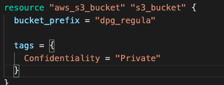

# 003 Tagging Standards

In this use case, you are provided with a set of Terraform scripts, as well as a Regula custom rule implemented using OPA.

The goal of this exercise is to familiarise yourself with implementing custom Regula rules using the OPA Rego language.

We will be implementing an internal compliance rule, ensuring that the correct tags are included with supported AWS resources.


## Custom Rule

We will begin by implementing two custom rules.

| Rule ID | Rule Description | Rule Scope |
| ------- | ---------------- | ---------- |
| DPG_TAG_STANDARDS | Taggable resources should have standard tags attached | a lot |


### Creating the tagging

Within the `policy` directory, create a new file called `tag_sets.rego` and copy-and-paste the following content:

```Open Policy Agent
# The following rule checks that "taggable" resource types have tag
# values with at least 6 characters.
package rules.tag_all_resources

# Provides the allow / deny resource with message functionality
import data.fugue

# Meta documentation, displayed in test output
__rego__metadoc__ := {
  "id": "DPG_TAG_STANDARDS",
  "title": "Taggable resources should have standard tags attached",
  "description": "Taggable resources should have standard tags attached",
  "custom": {
    "severity": "Medium"
  }
}


# We want to process more than one type of resource
resource_type = "MULTIPLE"

# Resources which this rule supports
taggable_resource_types = {
  "aws_cloudfront_distribution",
  "aws_cloudwatch_event_rule",
  "aws_cloudwatch_log_group",
  "aws_cloudwatch_metric_alarm",
  "aws_cognito_user_pool",
  "aws_db_instance",
  "aws_dynamodb_table",
  "aws_ebs_volume",
  "aws_eip",
  "aws_elasticache_cluster",
  "aws_elb",
  "aws_instance",
  "aws_internet_gateway",
  "aws_kms_key",
  "aws_lambda_function",
  "aws_lb",
  "aws_s3_bucket",
  "aws_security_group",
  "aws_subnet",
  "aws_vpc"
}

# Ensure the resource we are looking at supports tags
taggable_resources[id] = resource {
  some resource_type
  taggable_resource_types[resource_type]
  resources = fugue.resources(resource_type)
  resource = resources[id]
}

# Define which tags we require to be applied
required_tags = { "Team", "Confidentiality"}


policy[r] {
  # Identify taggabled resources
  resource = taggable_resources[_]

  # Identify the tags applied to the resource
  keys := {key | resource.tags[key]}

  # Subtract the actual tags from the required tags to see which ones are missing
  leftover := required_tags - keys
  
  # Fail if the leftover set is not empty
  not leftover == set()

  # Create a message string to describe which tags are missing
  msg = sprintf("Tags missing: %s", [leftover])

  # Return the message
   r = fugue.deny_resource_with_message(resource, msg)
} {
  # Identify taggabled resources
  resource = taggable_resources[_]

  # Identify the tags applied to the resource
  keys := {key | resource.tags[key]}

  # Subtract the actual tags from the required tags to see which ones are missing
  leftover := required_tags - keys
  
  # Success if the leftover set is not empty
  leftover == set()
  r = fugue.allow_resource(resource)
}

```

You can now test the rule by running the following command:

`regula run -u  --include policy tf --format table`

This should output:


In this rule, we actually provide some information from the resource, to describe which tags are missing. You can see in the output:

* aws_dynamodb_table is missing the Confidentiality tag
* aws_s3_bucket is missing the Team tag.

## Fixing the S3 Bucket 

Open up the [s3_bucket](tf/s3_bucket.tf) Terraform file. You should see that there is a tag implement for `Confidentiality`. 



Copy this to the next line and rename it `Team`, and apply the value `DevOps-Playground`.


Now re-run regula, which should give the following output:


## Fixing the DynamoDB Table

Open up the [dynamo_db_table](tf/dynamo_db_table.tf) Terraform file. You should see that there is a tag implement for `Team`. 


Copy this to the next line and rename it `Confidentiality`, and apply the value `Private`.


Now re-run regula, which should give the following output:


And that completes our playground!